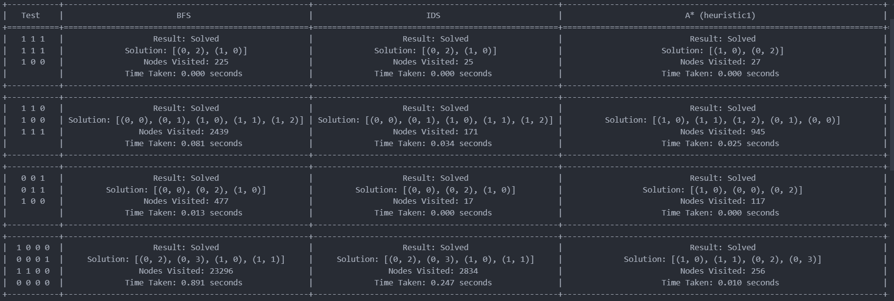

# AI Search Algorithms for the "Lights Out" Puzzle

<br>

<p align="center">
  
</p>

<p align="center">
  A comparative analysis of various uninformed and informed search algorithms implemented in Python to solve the "Lights Out" puzzle. This project demonstrates foundational AI concepts and performance benchmarking.
</p>

<p align="center">
    
    
</p>

---

## 🎯 Project Overview

The "Lights Out" puzzle is a classic logic problem presented on a two-dimensional grid, typically of size *n x n*. Each cell in the grid represents a light that can exist in one of two discrete states: 'on' or 'off'.

The fundamental rule of the puzzle is that interacting with any single light toggles the state of both that light and its **orthogonal neighbors** (the cells directly above, below, left, and right). Given an initial, random configuration of lights, the objective is to determine a sequence of interactions that will transition all lights to the 'off' state.

This project implements several classical AI search algorithms to find the solution and provides a comparative analysis of their performance and efficiency in navigating the puzzle's state space.

---

## ✨ Algorithms Implemented

This repository includes the following search algorithms:

* **Uninformed Search:**
    * Breadth-First Search (BFS)
    * Depth-First Search (DFS)
    * Iterative Deepening Search (IDS)
* **Informed (Heuristic) Search:**
    * A\* Search
    * Weighted A\* Search

Several custom heuristics were designed and tested for the A\* algorithm to analyze their impact on performance.

---
## Solving Example

### Running Test Input:
```
[[1 0 0 0 0]
 [0 0 1 0 0]
 [1 0 1 0 0]
 [0 1 0 0 0]
 [0 0 0 0 0]]
```

### Solving with BFS:
- **Solution:** `[(0, 0), (1, 1), (2, 1)]`
- **Nodes visited:** `10875`

### Solving with IDS:
- **Solution:** `[(0, 0), (1, 1), (2, 1)]`
- **Nodes visited:** `145`

### Solving with A* (heuristic1):
- **Solution:** `[(2, 1), (1, 1), (0, 0)]`
- **Nodes visited:** `75`

### Solving with A* (heuristic2):
- **Solution:** `[(0, 0), (1, 1), (2, 1)]`
- **Nodes visited:** `600`

### Solving with A* (heuristic3):
- **Solution:** `[(1, 1), (2, 1), (0, 0)]`
- **Nodes visited:** `75`

### Solving with Weighted A* (weighted_heuristic1, alpha = 2):
- **Solution:** `[(2, 1), (0, 0), (1, 1)]`
- **Nodes visited:** `1150`

### Solving with Weighted A* (weighted_heuristic1, alpha = 5):
- **Solution:** `[(2, 1), (0, 0), (1, 1)]`
- **Nodes visited:** `4475`

### Solving with Weighted A* (weighted_heuristic2, alpha = 2):
- **Solution:** `[(1, 1), (2, 1), (0, 0)]`
- **Nodes visited:** `75`

### Solving with Weighted A* (weighted_heuristic2, alpha = 5):
- **Solution:** `[(1, 1), (2, 1), (0, 0)]`
- **Nodes visited:** `75`

## Usage

To run the full analysis and generate the comparison table, execute the main script:
```bash
python main.py

